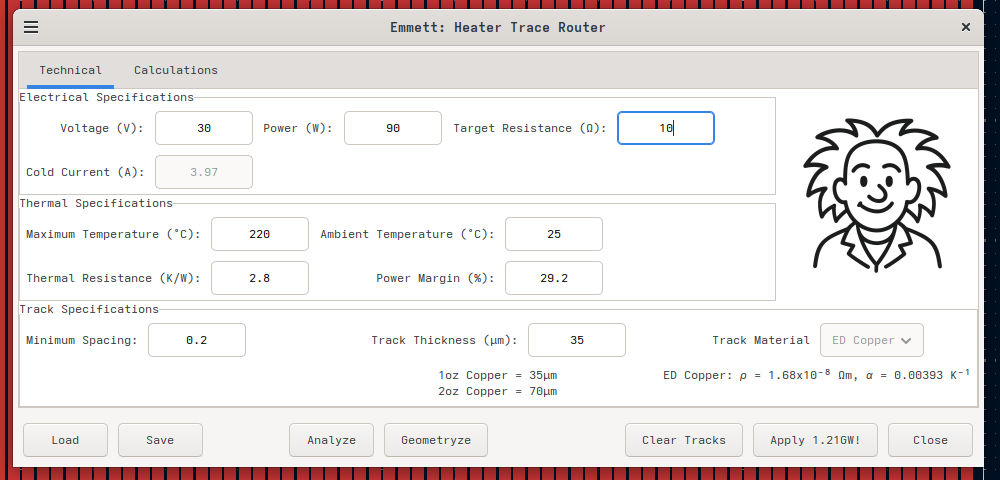
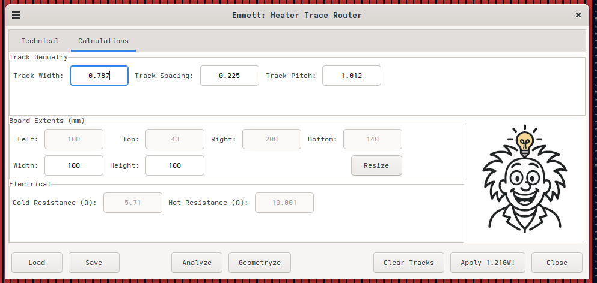

# Emmett KiCad Plugin

Welcome to the Emmett Element Router - a comprehensive helper for routing heating element traces.

If you're looking for some way to control your hotplate, maybe [Milton](https://github.com/brettski74/Milton) can help.

Join us on [Discord](https://discord.gg/dnQJEGFCZ9) to meet other people interested in DIY solder reflow hotplates, ask questions, make suggestions or discuss problems. You can also raise issues here and I'll take a look when I can.

# Features

- Supports single-sided Aluminium PCB layouts.
- Includes DIY thermal fuse in the layout for safety.
- Allows resizing of the board to suit requirements.
- Performs basic thermal calculations to determine feasibility of proposed design.
- Calculates optimal resistance values based on power, temperature and voltage requirements of the hotplate.
- Optimize track geometry to achieve desired resistance value.
- Opens a dialog for entering heating element design parameters
- Allowance for process variability in copper thickness and minimum clearances.

# Requirements

- KiCad 9.0 or later
- Python 3.6+ (included with KiCad)

**NOTE: This plugin is built using the Python SWIG API for KiCad which has been deprecated by the KiCad development team. Support for the SWIG API may be removed in KiCad 10 or a later version of KiCad, at which time this plugin will cease to work as it is currently written.**

# Installing Emmett

1. Download the release ZIP file (eg. emmett-1.0.0.zip)
2. Open KiCad
3. Launch the Plugin and Content Manager
4. Click the *Install from File...* button.
5. Select the release ZIP file you downloaded (eg. emmett-1.0.0.zip)

You should now see Emmet show up among your installed plugins. When you open KiCad, you should see a new button on the tool bar for launching the Emmett dialog.

# Using Emmett

Emmett is designed to work with purpose-designed PCB layouts for heating elements. The current version only supports a single layout algorithm for an aluminium hotplate design of mine. It includes a thermal fuse which you must create on the manufactured boards for them to work and has surface mount pads for power connection. The fuse link and power connections must be soldered in place using a higher temperature solder alloy. Despite the presence of the thermal fuse and the use of higher temperature solder alloys, there is a risk that your live power connections reflow and the cables become loose. This may pose a risk of fire or equipment damage.

**It is important to ensure that your hotplate assembly includes precautions to limit the movement of the live cable ends should they become detached during a fault or other unintended modes of operation.**

You can find a hotplate layout that works with Emmett in the releases.

Load the hotplate layout.
Click the Emmett button on the toolbar to launch Emmett.



When you first open Emmett, he will analyze the currently open PCB layout to deduce some parameter values from it. On the *Technical* tab, you set most of the relevant design parameters for creating your hotplate.

## Electrical Specifications

The most likely parameters you may wish to change are the voltage and power capabilities of your power supply. These will determine the ideal resistance of the heating element on your hotplate. The *Target Resistance* will normally be calculated based on the voltage and power you provide, but you can manually enter a value if you desire.

The *Cold Current* value shows how much current will be required at ambient temperature to produce the required power in your heating element. This can give you some idea of how current constrained the design may be at low temperatures.

### Specifying Voltage and Power

Power applied to the hotplate is what matters most for achieving certain temperatures and rates of heating. You should let the thermal specifications guide the power requirements for your hotplate. If you have power to burn, you can increase the power and power margin to your heart's content, but excessive power won't really help that much. Depending on your control strategy, extremely excessive power could pose controllability problems.

Voltage is a different matter. The following advice assumes that your power supply has some way of limiting the current to safe levels regardless of the load of the current voltage and current set points. If you're power constrained, then your best bet is to specify the maximum voltage that your power supply can handle. The heating element resistance will increase with temperature. Because of this, you will be current constrained at low temperatures and voltage constrained at high temperatures. You want to take advantage of the maximum power into your hotplate at reflow temperatures because that is where the effects of thermal leakage to the ambient will be the highest and therefore you'll need the most power there to keep increasing temperature. If you are not power constrained and have the ability to vary the voltage applied to the hotplate, you may want to select a lower operating voltage. The *Cold Current* field will show the current required to reach your design power when the hotplate is at ambient temperature. Ideally you would select an operating voltage that produces a cold current value that is within the current output limits of your power supply.

## Thermal Specifications

The *Thermal Specifications* can also be tailored to your needs. All of the parameters in this section ultimately affect how much power we assume will be needed by your hotplate design to perform.

For standard tin-lead solders that melt at around 183°C, the standard temperature settings or 220°C and 25°C should be sufficient. If you're worried about tripping your thermal fuse or wear and tear on your board, you can run it at a lower temperature but unless you are seriously power constrained (eg. below 30% power margin) it is probably best to leave the maximum temperature at 220°C.

*Thermal Resistance* provides a measure of how quickly and easily your hotplate assembly loses heat to the surrounding environment. Technically, this is the thermal resistance from your hotplate assembly to the ambient environment. The lower this value, the faster heat leaks into the surrounding environment, which means that it requires more power just to resist the natural cooling from convection, conduction and radiation. This value will be estimated based on the dimensions of your hotplate. The formula used for this is somewhat speculative and based on a limited amount of empirical data. Your mileage may vary.

*Power Margin* is a somewhat arbitrary factor relating how much power you need to hold the hotplate at it's maximum temperature versus how much power is available to drive the hotplate. To heat the hotplate and its load up quickly, you need substantially more than just the holding power. A power margin of 100% is recommended. This basically sets the power requirement for your hotplate to double the holding power (ie. the holding power + 100% of the holding power on top of that). Values below about 25% may be sluggish and may struggle to reach the desired reflow temperatures in the available time unless you modify your reflow profiles to be much longer than are typical. Even at a power margin of 25-30% you may need to increase the length of your profile by 50-100% in order to give the hotplate long enough to heat up to the required temperatures to form good solder joints. 100% is a good target that should allow your hotplate to reach reflow temperatures in times comparable to standard reflow profiles.

## Track Specifications

*Minimum Spacing* sets the minimum distance between the adjacent edges of adjacent tracks - ie. the width of the non-conductive space between adjacent tracks. 0.2mm is a fairly safe and conservative value that should work for most PCB manufacturers. There's probably no need to go smaller.

*Track Thickness* sets the thickness of the copper layer that will be on your finished PCB. For 1oz copper, this should be 35µm, although it's possible that with different manufacturers or even different batches from the same manufacturer it could vary. If you've ordered PCB hotplates before, you'll know that the resistance of the manufactured PCBs does not always match the theoretical calculations. It's difficult for me to say why this is. It could be due to a variety of possible causes including a thinner than expected copper layer, etching undercut (ie. narrower than expected traces), oxidation or impurities in the copper... Who knows? Without expensive test and measurement equipment I cannot say for sure. Whatever the reason, if you're finding that the resistance of your manufactured PCB heaters is wildly different from expected, this is a parameter that you can use to adjust the calculations, spin up a new board and have that manufactured to hopefully meet your resistance expectations.

*Track Material*... It's possible that PCB hotplates could be manufactured using a conductive material other than copper. While I've given some thought to this possibility, it seems unlikely for there to be other options for DIYers at this time, so I've forgone the effort to implement support for other materials at this time. If this situation should change, maybe we can update Emmett to know about other material properties. This version explicitly uses the published values for copper.



## Track Geometry

*Track Width* is the width in millimetres of the tracks that will be created for your heating element. Narrower tracks produce higher resistances. Wider tracks produce lower resistances. Ideally, you would allow the form to calculate the optimal value for this for you based on the thermal and electrical specifications you've provided, but if you want, you can manually enter a value here instead. You do you!

*Track Spacing* is the width of the non-conductive space between adjacent edges of adjacent tracks. Ideally we want to keep this as small as possible. Wider tracks are more durable and have better thermal coupling to the underlying substrate, both of which are desirable.

*Track Pitch* is the centre to centre measurement for adjacent tracks. Track pitch is what determines how many tracks can fit within a given width on the board. It is the sum of the track width and track spacing.

## Board Extents

The *Left*, *Top*, *Right* and *Bottom* values show the position of the edges of the board as defined by the edge cuts layer on your PCB. This is determined during board analysis and the values are read-only.

*Width* and *Height* show the width and height of the layout in millimetres. This is again derived from the edge cuts layer. Width is the difference of the right and left values. Height is the difference of the bottom and top values. They are editable, but changes to these values have no effect unless you click the *Resize* button. If you wish to change the size of your hotplate, you can modify the width and height values here and then click the *Resize* button. You should see the edge cuts and mounting holes move to create a layout with your new dimensions. Doing this will also automatically trigger a re-analysis of the board layout but will not trigger regeneration of the heating element tracks.

## Electrical

This shows the calculated values of the heating element resistance at ambient temperature (ie. *Cold Resistance*) and at the maximum operating temperature (ie. *Hot Resistance*). These are calculated during board analysis and after generation of new tracks.

## Buttons

*Load* Not currently implemented. The intention was to save the parameters to a file that could be loaded again later, but board analysis seems to make this moot. i may remove these buttons in a future version. For the moment, this does nothing when clicked.

*Save* Not currently implemented. See *Load*.

*Analyze* Initiate a new analysis of the board and update the parameters accordingly. This can be used to effectively revert all the edits that have been made on the form, but only if new tracks have not already been generated. While there are some minor differences between board analysis when the form is blank and when it's not, it will mostly overwrite most changes you may have made to parameters on the form.

*Geometryze* I'm well aware that this is not a real word, but let's make it one, Damnit! *Calculate* is too vague and *Recalculate Track Geometry* is too big and cumbersome to put on a button, so Geometryze it is. As already alluded to, this will update the track width, spacing and pitch to values that should achieve the target resistance value. It currently does not take into account things like operating voltage and power. It is assumed that hotplates designed by this form will only be used for relatively low voltages and power levels. If you're planning to build a hotplate that operates above 60V or 500W, you may want to include additional design considerations not intrinsically included in the calculations on this form.

*Clear Tracks* Remove all the tracks on the PCB. Not really needed in production, because when you generate the tracks, it will do this before laying out the new tracks, anyway. This was mostly useful to me during testing and I don't see much use in removing it because I may do more development in the future. So enjoy the beauty and harmony of the extra button.

*Apply 1.21GW!* I could have called this button *Generate* or maybe even *Apply* and while that probably would have been clear enough to most users, where is the fun in that. As you may have guessed, clicking this button will clear all tracks currently on the board and lay out new heating element tracks based on the *Track Geometry* parameters currently specified. Note that this process may also move the location of the thermal fuse and power connection pads slightly in order to fit optimally between the generated tracks.

*Close* Closes the form.

# Building the Plugin

```bash
cd src
make package
```

This creates `emmett-<version>.zip` in the build directory. You can then install this using the *Install from File...* option in KiCad's Plugin and Content Manager.

# Troubleshooting

TBA...

# License

See [LICENCE.md](./LICENCE.md) for details.

# Contributing

No real guidelines as of yet, but if you have any suggestions or find any bugs feel free to create an issue against this project. Maybe take a look at existing issues to see if it's already been reported/suggested first. Also feel free to send me pull requests. I can't guarantee that I'll accept them, but they are welcome.
